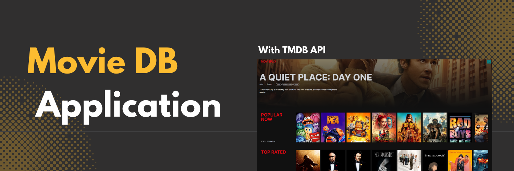

<div align="center">
  <br />
    <a href="https://youtube.com/playlist?list=PLJT1e2CqMCFDnMjX4U4MC2agPKcCbkbF-&si=hvuWRYAWYqcxH6wF" target="_blank">
      
    </a>
  <br />

  <div>
    
    
    
    
  </div>

  <h3 align="center">Movie Database Application</h3>

<div align="center">
     Build this project step by step with a detailed tutorial on <a href="https://www.youtube.com/@codespirit369/videos" target="_blank"><b>Code Spirit</b></a> YouTube. 
    </div>
</div>

## 📋 <a name="table">Table of Contents</a>

1. 🎬 [Introduction](#introduction)
2. ⚙️ [Tech Stack](#tech-stack)
3. 🔋 [Features](#features)
4. 🚀 [Quick Start](#quick-start)
5. 🕸️ [Snippets (Code to Copy)](#snippets)

## 🚨 Tutorial

This repository contains the code corresponding to an in-depth tutorial available on our YouTube channel, <a href="https://www.youtube.com/@codespirit369/videos" target="_blank"><b>Code Spirit</b></a>.

<a href="https://youtu.be/hs6BtY9ndXA" target="_blank"></a>

## <a name="tech-stack">⚙️ Tech Stack</a>

- React.js
- Next.js
- Typescript
- TailwindCSS
- TMDB API

## <a name="introduction">🎬 Introduction</a>

A Movie Database application that allows users to easily discover and explore movies. Featuring a banner section with now-playing movies, rows for top-rated, popular, and upcoming movies, and a row dedicated to movie genres. Users can discover movies by genre, see recommendations, and view detailed information for each movie.

## <a name="features">🔋 Features</a>

👉 Now Playing Movies in a banner section

👉 Rows for Top Rated, Popular, and Upcoming Movies

👉 Discover Movies by Genre

👉 View detailed information for each movie, including recommendations

👉 Responsive design for optimal user experience on all devices

## <a name="quick-start">🚀 Quick Start</a>

Follow these steps to set up the project locally on your machine.

**Prerequisites**

Make sure you have the following installed on your machine:

- [Git](https://git-scm.com/)
- [Node.js](https://nodejs.org/en)
- [npm](https://www.npmjs.com/) (Node Package Manager)

**Cloning the Repository**

```bash
git clone https://github.com/code-spirit-369/movie-db-app.git
cd movie-db-app
```

**Installation**

Install the project dependencies using npm:

```bash
npm install
```

**Set Up Environment Variables**

Create a new file named `.env.local` in the root of your project and add the following content:

```env
TMDB_API_KEY=
```

Get your Gemini AI API key from [TMDB](https://www.themoviedb.org/).

**Running the Project**

```bash
npm run dev
```

Open [http://localhost:3000](http://localhost:3000) in your browser to view the project.

## <a name="snippets">🕸️ Code Snippets</a>

<details>
<summary><code>types/index.ts</code></summary>

```typescript
interface Movie {
  adult: boolean;
  backdrop_path: string;
  genre_ids: number[];
  id: number;
  original_language: string;
  original_title: string;
  overview: string;
  popularity: number;
  poster_path: string;
  release_date: string;
  title: string;
  video: boolean;
  vote_average: number;
  vote_count: number;
  media_type?: string;
}
```

</details>

<details>
<summary><code>constants/index.ts</code></summary>

```typescript
export const genres = [
  {
    id: 28,
    name: "Action",
    color: "#FF5733",
  },
  {
    id: 12,
    name: "Adventure",
    color: "#FF8D1A",
  },
  {
    id: 16,
    name: "Animation",
    color: "#FFC300",
  },
  {
    id: 35,
    name: "Comedy",
    color: "#DAF7A6",
  },
  {
    id: 80,
    name: "Crime",
    color: "#900C3F",
  },
  {
    id: 99,
    name: "Documentary",
    color: "#C70039",
  },
  {
    id: 18,
    name: "Drama",
    color: "#581845",
  },
  {
    id: 10751,
    name: "Family",
    color: "#FFC0CB",
  },
  {
    id: 14,
    name: "Fantasy",
    color: "#8E44AD",
  },
  {
    id: 36,
    name: "History",
    color: "#2980B9",
  },
  {
    id: 27,
    name: "Horror",
    color: "#2C3E50",
  },
  {
    id: 10402,
    name: "Music",
    color: "#1ABC9C",
  },
  {
    id: 9648,
    name: "Mystery",
    color: "#2ECC71",
  },
  {
    id: 10749,
    name: "Romance",
    color: "#E74C3C",
  },
  {
    id: 878,
    name: "Science Fiction",
    color: "#3498DB",
  },
  {
    id: 10770,
    name: "TV Movie",
    color: "#9B59B6",
  },
  {
    id: 53,
    name: "Thriller",
    color: "#34495E",
  },
  {
    id: 10752,
    name: "War",
    color: "#7F8C8D",
  },
  {
    id: 37,
    name: "Western",
    color: "#D35400",
  },
];
```

</details>

<details>
<summary><code>global.css</code></summary>

```typescript
@tailwind base;
@tailwind components;
@tailwind utilities;

@layer base {
  :root {
    --background: 0 0% 100%;
    --foreground: 222.2 84% 4.9%;
    --card: 0 0% 100%;
    --card-foreground: 222.2 84% 4.9%;
    --popover: 0 0% 100%;
    --popover-foreground: 222.2 84% 4.9%;
    --primary: 222.2 47.4% 11.2%;
    --primary-foreground: 210 40% 98%;
    --secondary: 210 40% 96.1%;
    --secondary-foreground: 222.2 47.4% 11.2%;
    --muted: 210 40% 96.1%;
    --muted-foreground: 215.4 16.3% 46.9%;
    --accent: 210 40% 96.1%;
    --accent-foreground: 222.2 47.4% 11.2%;
    --destructive: 0 84.2% 60.2%;
    --destructive-foreground: 210 40% 98%;
    --border: 214.3 31.8% 91.4%;
    --input: 214.3 31.8% 91.4%;
    --ring: 222.2 84% 4.9%;
    --radius: 0.5rem;
    --chart-1: 12 76% 61%;
    --chart-2: 173 58% 39%;
    --chart-3: 197 37% 24%;
    --chart-4: 43 74% 66%;
    --chart-5: 27 87% 67%;
  }

  .dark {
    --background: 222.2 84% 4.9%;
    --foreground: 210 40% 98%;
    --card: 222.2 84% 4.9%;
    --card-foreground: 210 40% 98%;
    --popover: 222.2 84% 4.9%;
    --popover-foreground: 210 40% 98%;
    --primary: 210 40% 98%;
    --primary-foreground: 222.2 47.4% 11.2%;
    --secondary: 217.2 32.6% 17.5%;
    --secondary-foreground: 210 40% 98%;
    --muted: 217.2 32.6% 17.5%;
    --muted-foreground: 215 20.2% 65.1%;
    --accent: 217.2 32.6% 17.5%;
    --accent-foreground: 210 40% 98%;
    --destructive: 0 62.8% 30.6%;
    --destructive-foreground: 210 40% 98%;
    --border: 217.2 32.6% 17.5%;
    --input: 217.2 32.6% 17.5%;
    --ring: 212.7 26.8% 83.9%;
    --chart-1: 220 70% 50%;
    --chart-2: 160 60% 45%;
    --chart-3: 30 80% 55%;
    --chart-4: 280 65% 60%;
    --chart-5: 340 75% 55%;
  }
}

@layer base {
  * {
    @apply border-border;
  }
  body {
    @apply bg-background text-foreground;
  }
}

@layer utilities {
  /* Hide scrollbar for Chrome, Safari and Opera */
  .no-scrollbar::-webkit-scrollbar {
    display: none;
  }
  /* Hide scrollbar for IE, Edge and Firefox */
  .no-scrollbar {
    -ms-overflow-style: none; /* IE and Edge */
    scrollbar-width: none; /* Firefox */
  }
}

```

</details>
